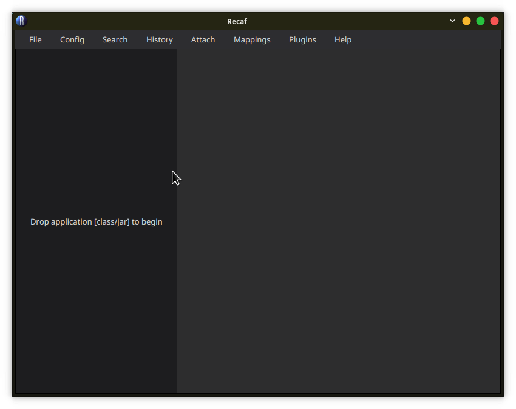

## 3. How to use recaf

When you open Recaf, it will be an empty window

Take your .jar and drop it in the left side of the window, it will open

In that case, we have what I call the "BenVirus". It is a cheap, unobfuscated and terrible grabber.

The sender is the class Ben in the package net.jodah.typetools.

You can see each payload in the package net.jodah.typetools.impl

Now, we will copy the two first lines of the constructor.

The first one is a cheap attempt at hiding the webhook

Create, open or otherwise obtain an empty Java project (for convenience but you can use one you already use) and run it in any way you can.

If you are lazy, dumb, dont want to / can't compile Java, use an online compiler like Repl.it

We now have a discord webhook !

## 4. Delete the webhook

In this repository, I have provided you a straight-forward solution to send one message to the webhook and then delete it.

If you want to be stealthy, you can remove the line that send the message.

Please note that it work on linux only and require the curl command.

allow it to run using the chmod command, then run it with your webhook as argument : 

  
_Please note that in my case it failed because I already deleted it before_

And done ! that grabber is no longer working.
